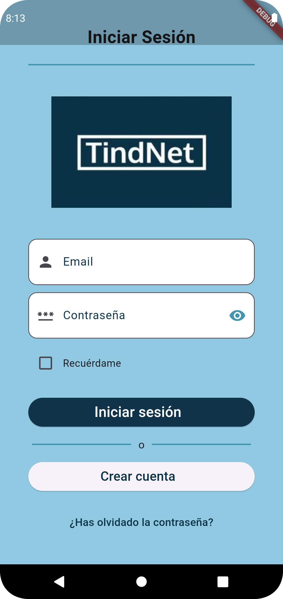
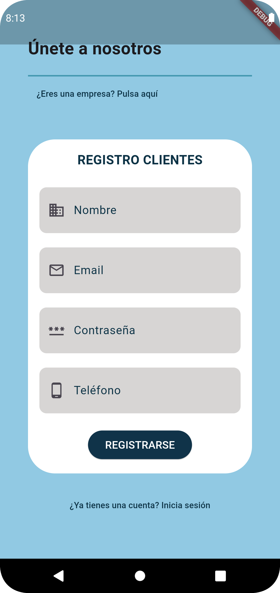
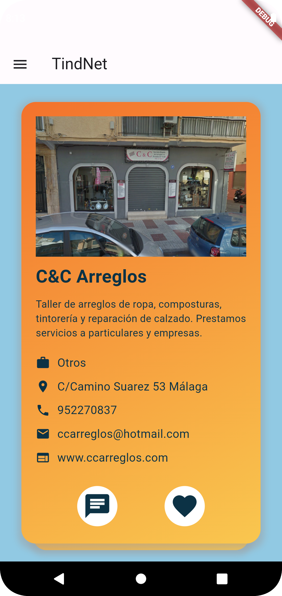
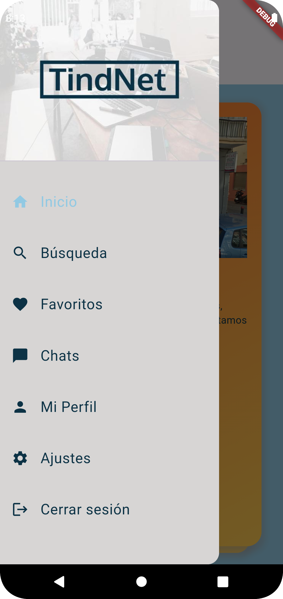
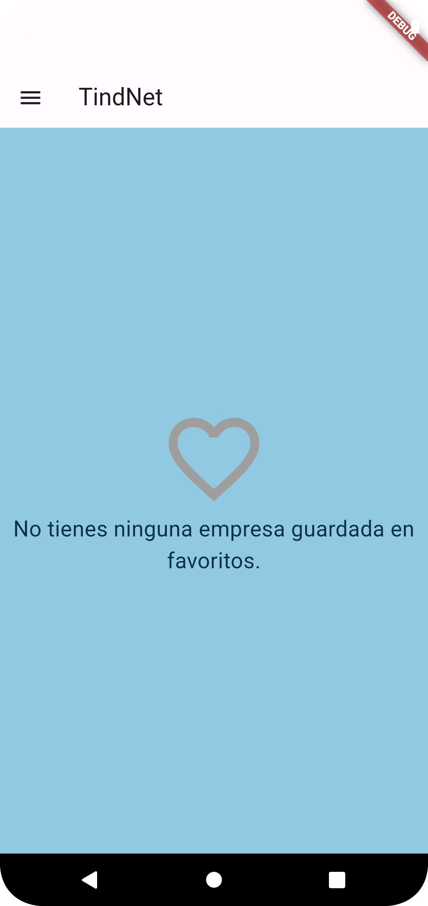
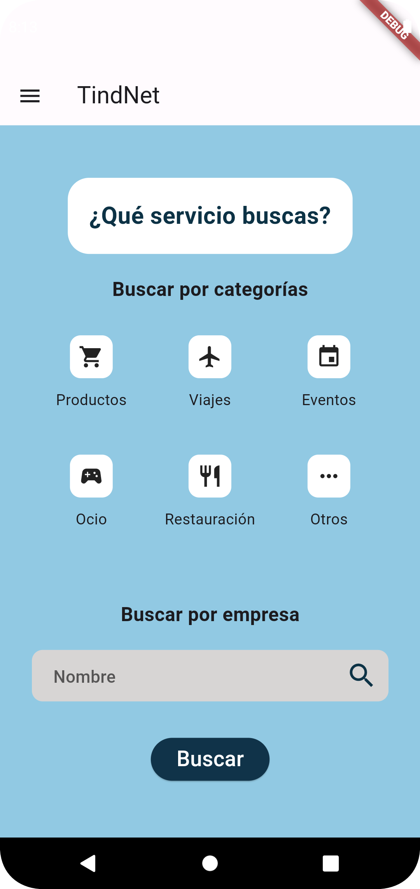
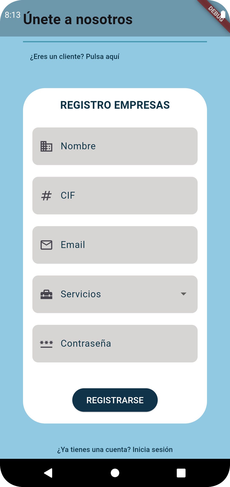
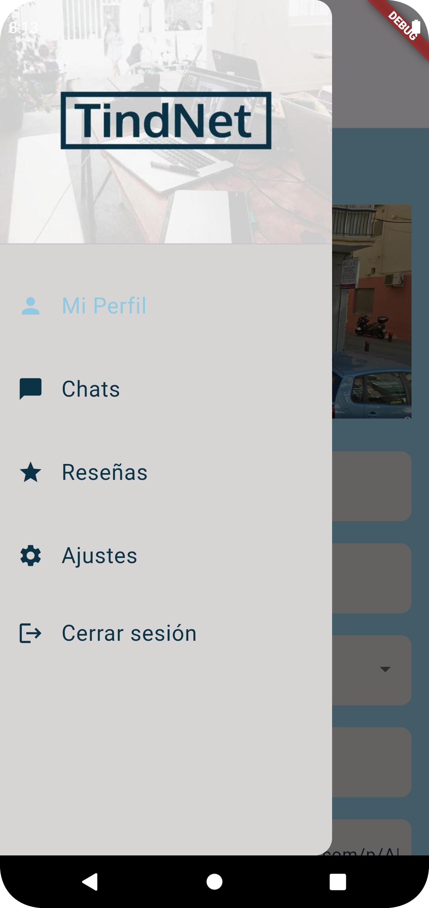

# 📱 TindNet

TindNet es una aplicación móvil desarrollada en Flutter que permite a los usuarios descubrir empresas locales mediante una interfaz intuitiva de deslizamiento similar a las aplicaciones de citas.

## 🎥 Demo del Proyecto

Mira el funcionamiento completo de la aplicación en este vídeo demostrativo:

> 💡 Demostración completa del flujo de uso para clientes y empresas

## 📱 Capturas de Pantalla

  <table>
    <tr>
      <td align="center">
        
         
        <b>Pantalla de Inicio</b>
         
        Primera vista de la aplicación
      </td>
      <td align="center">
        
         
        <b>Login</b>
         
        Inicio de sesión para usuarios
      </td>
      <td align="center">
        
         
        <b>Registro de Clientes</b>
         
        Formulario de registro para clientes
      </td>
    </tr>
    <tr>
      <td align="center">
        
         
        <b>Tarjetas de Empresa</b>
         
        Tarjeta informativa de la empresa, like para marcarla favorita o iniciar un chat
      </td>
      <td align="center">
        
         
        <b>Menú de Clientes</b>
         
        Centro de gestión de clientes con acceso a favoritos, perfil, chats y configuración
      </td>
      <td align="center">
        
         
        <b>Favoritos</b>
         
        Empresas guardadas por el usuario como favoritas
      </td>
    </tr>
    <tr>
      <td align="center">
        
         
        <b>Búsqueda</b>
         
        Búsqueda de empresas por filtros
      </td>
      <td align="center">
        
         
        <b>Registro de Empresas</b>
         
        Alta de nuevas empresas
      </td>
      <td align="center">
        
         
        <b>Menú de Empresas</b>
         
        Centro de gestión de empresas con acceso al perfil, chats, reseñas y configuración 
      </td>
    </tr>
  </table>

## ✨ Características principales

- **Descubrimiento de empresas**: Desliza entre diferentes empresas locales para descubrir nuevos negocios.
- **Sistema de favoritos**: Guarda tus empresas favoritas para acceder rápidamente a ellas más tarde.
- **Chat integrado**: Comunícate fácilmente con las empresas directamente desde la aplicación.
- **Perfiles detallados**: Visualiza información completa sobre cada empresa, incluyendo ubicación, horarios y servicios.
- **Filtros personalizados**: Encuentra empresas que se adapten a tus necesidades específicas.

## 🛠️ Tecnologías utilizadas

- Dart como lenguaje de programación
- Flutter para el desarrollo multiplataforma
- Firebase como backend (Autenticación, Firestore, Storage)

## 📲 Instalación

1. Clona este repositorio
2. Ejecuta `flutter pub get` para instalar las dependencias
3. Configura tus propias credenciales de Firebase (ver sección de configuración)
4. Ejecuta `flutter run` para iniciar la aplicación

## 🔥 Configuración de Firebase

Para ejecutar la aplicación necesitarás:
1. Crear un proyecto en [Firebase Console](https://console.firebase.google.com/)
2. Obtener los archivos de configuración:
   - `google-services.json` para Android
   - `GoogleService-Info.plist` para iOS
   - `firebase_options.dart` usando FlutterFire CLI
3. Colocar los archivos en sus respectivas ubicaciones

## 🤝 Contribución

Las contribuciones son bienvenidas. Por favor, abre un issue primero para discutir los cambios propuestos.

## 📄 Licencia
Este proyecto está licenciado bajo la [Licencia MIT](LICENSE).

